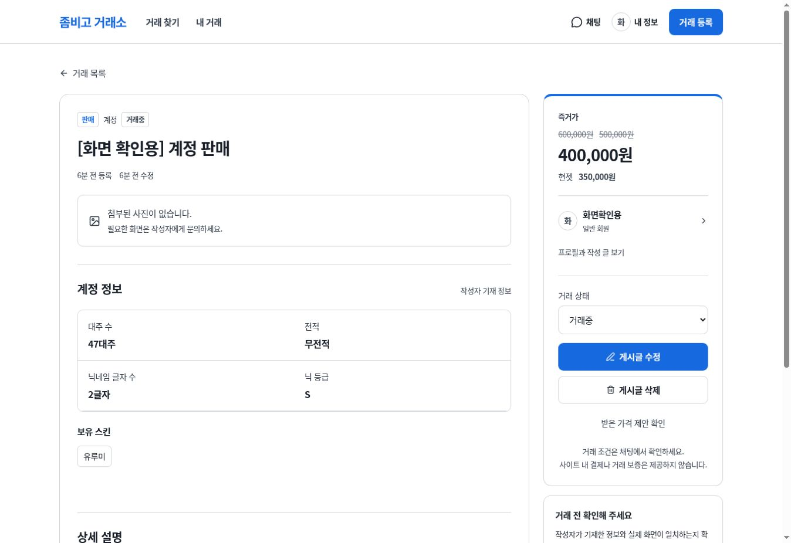

# v9 검증 기록

검증일: 2026-09-30

## 구현

- 구매, 판매, 교환, 대리(구함), 대리(진행) 5개 탭 및 거래별 세부 분류.
- 교환의 제공 대상과 희망 대상 독립 선택. 목록에서 고른 방향이 작성 화면으로 이어짐.
- 구매 예산(MAX), 허용 대주 수, 전적 조건, 닉네임 범위/등급과 판매의 실제 정보 분리.
- 판매 즉거가와 현젯 독립 저장. 실제 대주 수는 1~9999 정수.
- 이전 즉거가를 서버 배치에서 기록하고 공개 목록/상세에 취소선 표시. 클라이언트의 임의 이력은 저장하지 않음.
- 구매와 판매의 검색 조건 분리. 불필요한 기존 URL 조건을 화면과 API 요청에서 제거.
- 흰색 바탕, 단일 파란색, 진한 본문과 명확한 테두리. 모바일 작성 버튼 가로 넘침 수정.

## 실행한 검증

| 검증 | 결과 |
| --- | --- |
| TypeScript 전체 검사 | 통과 |
| 독립 Worker 프로덕션 빌드 | 통과 |
| v9 API 검증 | 248개 통과 |
| 기존 기본 인증/채팅/프로필/게시글 검증 | 31개 통과 |
| 새 DB 전체 SQL 마이그레이션 | 통과 |
| 기존 교환 대상 호환 후속 마이그레이션 | 통과 |
| 잘못된 원격 DB 설정 차단 | 통과, 원격 요청 없음 |
| 브라우저 판매 등록 | 47대주, 닉 2글자/S, 유루미, 즉거가/현젯 별도 저장 확인 |
| 브라우저 즉거가 수정 | 600000 → 500000 → 400000, 공개 화면 취소선 및 현젯 350000 유지 확인 |
| 모바일 구매 작성 | 즉거가/현젯 및 가스/미네랄 입력란 0개, 허용 대주 수 입력란 1개 확인 |
| 모바일 구매 등록 | MAX 300000원, 50대주 이하, 전적 있어도 괜찮음 공개 표시 확인 |
| 교환 작성 연결 | 클랜에서 계정 구함이 작성 화면의 두 선택과 제공/희망 조건에 반영됨 |
| 모바일 외형 | 375px 프레임에서 목록 확인, 작성 하단 버튼의 가로 스크롤 수정 후 스크린샷 재확인 |

v9 API 검증에는 같은 가격 재저장, 가격 이력 위조, 동시 가격 수정, 다른 회원 수정/삭제 방어, 숫자 입력 검증, 구매 필드 정규화, 스킨/시즌 OR 검색, 4가지 교환 방향, 모든 세부 분류가 포함된다. 기본 검증은 가입/로그인/로그아웃, 1대1 채팅 권한, 읽음 표시와 공개 프로필의 비밀값 제외 등을 확인한다.

화면 검증용 계정과 매물은 로컬에서만 만들었다. 운영 사이트 또는 GitHub에는 테스트 데이터를 올리지 않았다. 임시 모바일 검증 HTML은 소스에서 제거했다.

## 저장소와 운영 배포

- 사용자 지정 저장소는 `sosirusok/tycg`이며, 기존 프로젝트 파일을 모두 교체하는 방식으로 이관한다.
- GitHub의 `main` 브랜치가 이 거래소의 소스 기준이다. 검증 결과는 저장소의 Actions에서 확인한다.
- 기존 정적 서비스의 `gh-pages` 파일은 정리 대상이다. GitHub Pages만으로 회원가입, 게시글 저장과 채팅 서버를 실행할 수는 없다.
- 운영 환경은 독립 Cloudflare Workers + D1 + R2 구성이며 실제 리소스 연결과 비밀값 등록이 필요하다. 로컬 검증 통과가 운영 배포 완료를 의미하지 않는다.
- 기존 ChatGPT Sites 서비스는 수정하거나 재배포하지 않았다.

## 화면 증거

